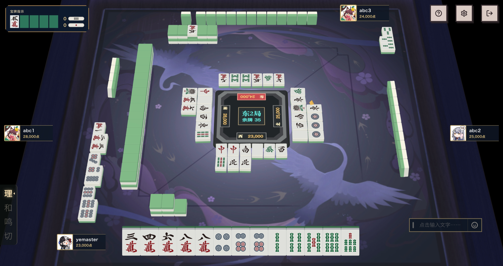

# MaMahjong

自部署网页端的多人联机麻将游戏服务，支持日本麻将（四麻/三麻）与冲击麻将。采用领域驱动设计，规则引擎与传输层解耦，可扩展至其他麻将玩法。

**在线演示**: 暂无，期待你的部署！

---

## 特性

- 支持日本麻将（四人/三人）与冲击麻将，规则可通过配置组合
- Web 前端游戏界面，规划桌面应用
- 二次元主题界面，樱花粉配色
- 房间系统与匹配系统，支持好友房与快速匹配
- 实时聊天与表情交互
- 内置牌效机器人用于测试与单人练习
- 服务端权威状态，客户端仅提交意图
- Docker Compose 一键部署，包含 PostgreSQL 数据库

---

## 目录

- [特性](#特性)
- [快速开始](#快速开始)
- [本地素材](#本地素材)
- [机器人测试](#机器人测试)
- [项目结构](#项目结构)
- [架构设计](#架构设计)
- [文档](#文档)
- [本地开发](#本地开发)
- [测试](#测试)
- [贡献](#贡献)
- [许可证](#许可证)

---

## 项目截图

> [!INFO]
>
> 本地测试使用了部分 雀魂游戏 的素材，仅供演示使用，实际仓库中不包含这些内容。

首页


大厅页


创建房间页


房间页


对局界面



和牌结算界面


点数变化界面


---

## 快速开始

### 环境要求

- Docker Engine
- Docker Compose v2

### 启动

```bash
git clone https://github.com/yemaster/mamahjong.git
cd mamahjong

cp .env.production.example .env.production
# 编辑 .env.production，修改数据库密码

docker compose --env-file .env.production up --detach --pull always
```

访问：

```text
http://127.0.0.1:8080/game/
```

### 关闭

```bash
docker compose --env-file .env.production down
```

### 更新

```bash
docker compose --env-file .env.production pull
docker compose --env-file .env.production up --detach
```

---

## 本地素材

仓库不提供也不分发雀魂等第三方游戏的角色、牌面、桌布、音乐和音效文件。
部署者需要在确认拥有合法使用权后，自行将素材补齐到以下目录：

```text
apps/game-web/public/assets/local-characters/   # 角色立绘、头像、表情和语音
apps/game-web/public/assets/local-game-assets/  # 牌面、桌布和音乐
apps/game-web/public/assets/sfx/                # 操作与结算音效
```

素材路径和文件名需要与服务端目录元数据及前端引用保持一致，具体约定见
[素材管线文档](docs/client/asset-pipeline.md)。这些目录已加入 `.gitignore`，不会被
Git 提交；未补齐时，对应的图片或音频不会显示或播放。

---

## 机器人测试

内置牌效机器人可自动完成完整对局：

```bash
# 依次测试四麻和三麻
cargo run -p mamahjong-bot -- --all

# 仅测试四麻
cargo run -p mamahjong-bot -- --variant yonma --quiet

# 仅测试三麻
cargo run -p mamahjong-bot -- --variant sanma --quiet
```

机器人完全通过 HTTP JSON 通信，可用作客户端实现参考。详见 [机器人文档](docs/client/bot.md)。

---

## 项目结构

```
mamahjong/
├── apps/
│   ├── server/          # 后端服务（Axum + WebSocket）
│   ├── game-web/        # 游戏 Web 前端（React + Vite）
│   ├── admin-web/       # 管理后台
│   └── desktop/         # 桌面客户端（规划中）
├── clients/
│   └── bot/             # 牌效机器人
├── crates/
│   ├── mamahjong-application/  # 应用层：用例编排、房间管理
│   ├── mahjong-core/           # 领域核心：规则引擎
│   ├── mahjong-riichi/         # 日麻规则实现
│   └── mahjong-impact/         # 冲击麻将规则实现
├── docs/                # 架构与设计文档
├── scripts/             # 本地启动与生产镜像发布脚本
├── compose.yaml         # 开发与生产共用的 Docker Compose 编排
└── Dockerfile           # 多阶段构建
```

**后端**
- Rust + Axum + Tokio
- PostgreSQL
- WebSocket 实时通信

**前端**
- React 19 + TypeScript
- Vite 8
- Three.js（3D 牌桌渲染）
- Zustand（状态管理）

---

## 架构设计

项目采用领域驱动设计，分层如下：

```
Web Client / Bot
        │ HTTP / WebSocket
Server transport
        │ commands / events
Application services
        │ use cases
Domain core
        │ ports
Infrastructure
```

核心原则：
- 领域层（`mahjong-core`）不依赖网络、数据库和具体客户端
- 服务端对游戏状态拥有唯一写权限，客户端只提交意图
- 新增川麻、武汉麻将等玩法时，不修改日麻内部实现
- 规则引擎通过 `RuleEngine` trait 扩展，各玩法独立实现

详见 [架构文档](docs/architecture/overview.md)。

---

## 文档

完整文档索引见 [docs/README.md](docs/README.md)。

### 架构

- [架构设计总览](docs/architecture/overview.md) — 分层设计、依赖规则、扩展点
- [领域模型](docs/architecture/domain-model.md) — 核心对象、聚合、不变量
- [后端运行骨架](docs/architecture/server-runtime.md) — 启动顺序、环境变量、健康检查

### 引擎

- [日麻规则配置](docs/engine/riichi-rules.md) — 配置结构、校验、预设与版本化快照
- [日麻和牌与计分](docs/engine/riichi-scoring.md) — 牌形搜索、役种目录、符计算与结算
- [日麻单局状态机](docs/engine/riichi-hand-state.md) — 聚合结构、命令、响应窗口、立直与流局
- [冲击麻将规则](docs/engine/impact-rules.md) — 自摸限定、财神、杠点与全交

### 协议与传输

- [通信 API 设计](docs/protocol/api.md) — HTTP 资源、WebSocket 建连、命令/事件/错误信封
- [实时传输](docs/protocol/realtime-transport.md) — WS 实现、事件裁剪、游标续传
- [操作时限与断线](docs/protocol/turn-timer.md) — 两段式时钟、超时动作、到期扫描与重连

### 客户端

- [网页客户端设计](docs/client/game-web.md) — React + PixiJS 架构、场景图、WS 集成
- [牌效机器人](docs/client/bot.md) — 向听数策略与受入计算

### 部署与项目

- [部署与运行](docs/deployment/overview.md) — Docker Compose 部署、配置、健康检查
- [开发路线](docs/project/roadmap.md) — M0–M9 里程碑与完成状态
- [开发规范](docs/project/develop-standard.md) — 代码修改流程、文档要求与提交约定

---

## 本地开发

### Docker 开发环境

构建并启动；代码更新后重复执行即可重建并重启：

```bash
./scripts/dev.sh
```

### 构建并发布生产镜像

指定新版本号发布 `linux/amd64` 和 `linux/arm64` 镜像：

```bash
./scripts/publish-images.sh 0.1.1
```

### 后端开发

```bash
# 启动数据库
docker compose up database --detach

# 本地运行服务端
cargo run -p mamahjong-server

# 代码检查
cargo fmt --all --check
cargo clippy --workspace --all-targets -- -D warnings
cargo test --workspace
```

### 游戏前端开发

```bash
cd apps/game-web
npm install
npm run dev       # 开发服务器 http://localhost:5173
npm run build     # 生产构建
npm run typecheck # 类型检查
npm test          # 运行测试
```

### 环境变量

编辑 `.env` 文件（参考 `.env.example`）：

```bash
# Web 出口绑定地址
MAMAHJONG_WEB_HOST=127.0.0.1
MAMAHJONG_WEB_PORT=8080

# 数据库配置
MAMAHJONG_DATABASE_NAME=mamahjong
MAMAHJONG_DATABASE_USER=mamahjong
MAMAHJONG_DATABASE_PASSWORD=your-secure-password

# 日志级别
RUST_LOG=info
```

---

## 测试

```bash
# 运行所有单元测试
cargo test --workspace

# 端到端机器人测试
./run-bots.sh

# 前端测试
cd apps/game-web && npm test
```

---

## 贡献

欢迎提交 Issue 和 Pull Request。贡献前请阅读 [开发规范](docs/project/develop-standard.md)。

1. Fork 本仓库
2. 创建功能分支（`git checkout -b feature/new-feature`）
3. 提交更改（`git commit -m 'Add new feature'`）
4. 推送到分支（`git push origin feature/new-feature`）
5. 提交 Pull Request

---

## 许可证

本项目采用 [MIT License](LICENSE) 开源。

---

## 致谢

- 日麻规则参考天凤与雀魂
- 牌面图案使用 [mahjong_graphic](https://github.com/lietxia/mahjong_graphic)
- 终端 UI 基于 [Ratatui](https://github.com/ratatui-org/ratatui)
- 部分本地测试素材采用了[雀魂](https://game.majhong-soul.com/)的素材
- 胡牌结算页面参考了麻雀一番街的样式
